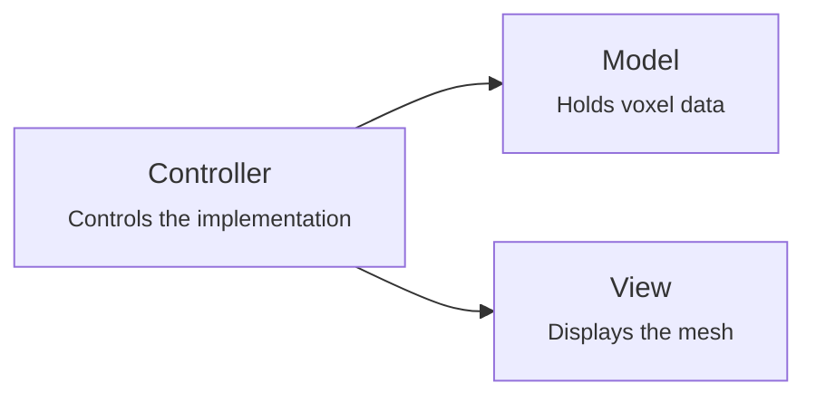
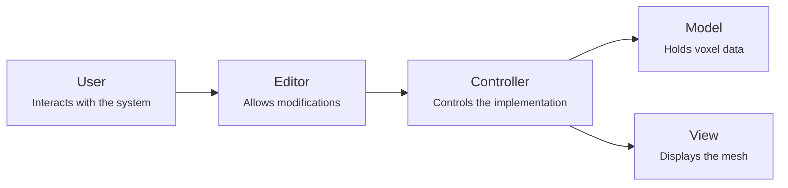
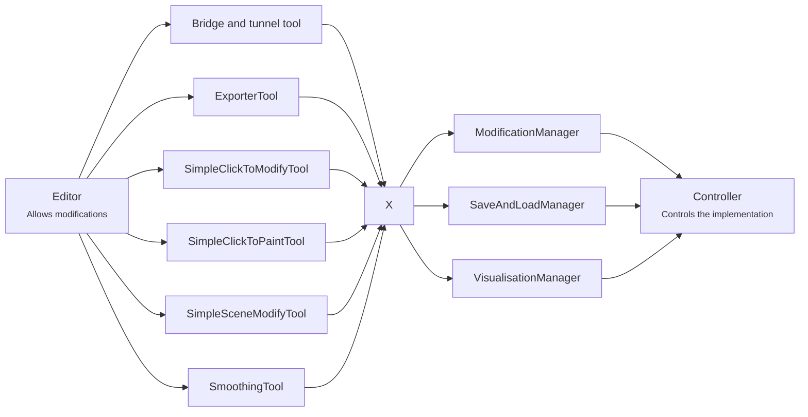

# Architecture
## Core

```mermaid
graph LR
    %% Core
    Controller["Controller<br><span style='font-size: 0.8em;'>Controls the implementation</span>"]
    Model["Model<br><span style='font-size: 0.8em;'>Holds voxel data</span>"]
    View["View<br><span style='font-size: 0.8em;'>Displays the mesh</span>"]

    Controller --> Model
    Controller --> View
```

## User interaction

```mermaid
flowchart LR
    %% User interaction
    User["User"<br><span style='font-size: 0.8em;'>Interacts with the system]
    Editor["Editor"<br><span style='font-size: 0.8em;'>Allows modifications]
    User --> Editor
    Editor --> Controller
    
    %% Core
    Controller["Controller<br><span style='font-size: 0.8em;'>Controls the implementation</span>"]
    Model["Model<br><span style='font-size: 0.8em;'>Holds voxel data</span>"]
    View["View<br><span style='font-size: 0.8em;'>Displays the mesh</span>"]

    Controller --> Model
    Controller --> View
```

## Tool integration

```mermaid
flowchart LR
    %% <br><span style='font-size: 0.8em;'>

    %% User interaction
    Editor["Editor"<br><span style='font-size: 0.8em;'>Allows modifications]

    %% Tool integration
    BridgeAndTunnelTool["Bridge and tunnel tool"]
    ExporterTool["ExporterTool"]
    SimpleClickToModifyTool["SimpleClickToModifyTool"]
    SimpleClickToPaintTool["SimpleClickToPaintTool"]
    SimpleSceneModifyTool["SimpleSceneModifyTool"]
    SmoothingTool["SmoothingTool"]
    X["X"]
    ModificationManager["ModificationManager"]
    SaveAndLoadManager["SaveAndLoadManager"]
    VisualisationManager["VisualisationManager"]

    Editor --> BridgeAndTunnelTool --> X
    Editor --> ExporterTool --> X
    Editor --> SimpleClickToModifyTool --> X
    Editor --> SimpleClickToPaintTool --> X
    Editor --> SimpleSceneModifyTool --> X
    Editor --> SmoothingTool --> X

    X --> ModificationManager --> Controller
    X --> SaveAndLoadManager --> Controller
    X --> VisualisationManager --> Controller

    %% Core
    Controller["Controller<br><span style='font-size: 0.8em;'>Controls the implementation</span>"]
```