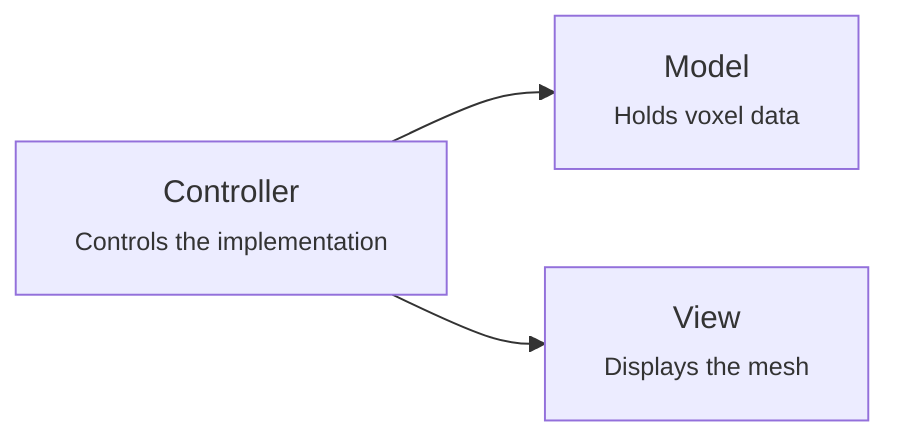
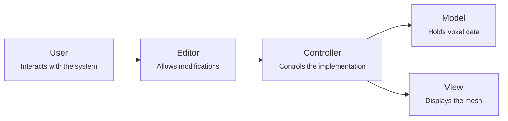
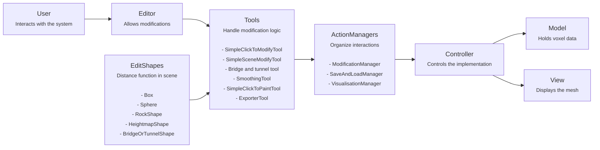

# Architecture
This architectural overview describes how the program is layed out.
## Core

The core is set up with a Model-View-Controller pattern.
- The model holds the voxel data.
- The view uses the model data to generate the mesh.
- The controller controls the interactions between the model and the view.

## User interaction

The goal of the system is that the user can modify the data. This is done by interacting with the editor component.

## Tool integration

In order to integrate the tools, 3 types of elements are used.
- The EditShapes contain the distance functions and are implemented as scene objects. This  allows to use the scene editor to display and modify them.
- The ActionManagers provided by the Controller to provide different functionalities to the Tools.
- The Tools are different ways how the voxel data can be modified or used. They are selected from and displayed by the editor. They use the EditShapes to control the modification location and the ActionManagers to interface with the voxel data.