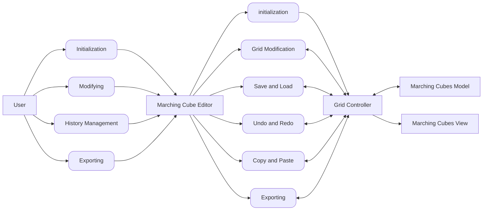
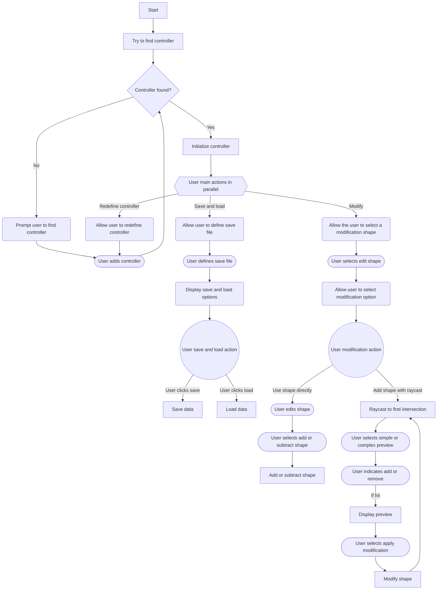
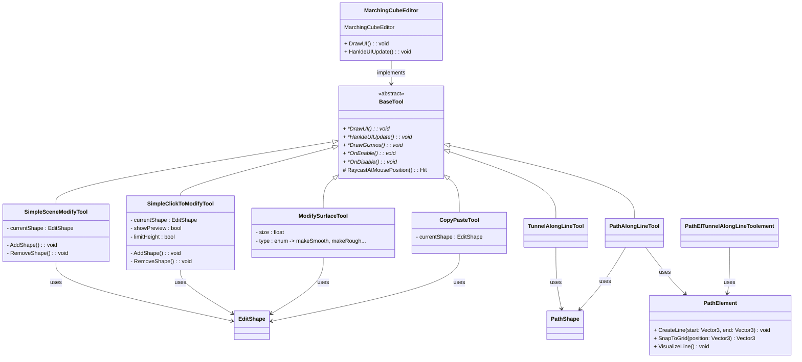

# Marching cube editor
## Architecture
### Facade for implementing functions

### Improved user experience

### Better tool integration

## Implementation elements
### Save and load

### Editing tools
#### Distance funciton shape
Shapes can be defiend using distance functions. These can be used within the voxel grid to calculate the influence over different data points. Various different tools can be defined by using different mathematical functions.
Simple shapes like:
- Sphere
- Cube

Smart shapes like:
- Tunnel
- Terrain heightmap
- Limits (like height limit)

#### Add and remove shape
Shapes can be added or removed by setting the new value based on the distance function.

#### Copy paste shape

#### Move shape

#### Scale shape

#### Edit by click and hold to and and remove

### Optimizations
#### Chunks with same resolution for faster editing

#### Chunks with different resolution for reduced visual load
-> Border region apparently difficult to handle

### Materials
#### Triplanar shader
Creating good UV maps for Marching cubes is likely not very feasible. Therefore, triplanar shaders should work best.

#### Auto textures
For most natural elements, automatically drawing the texture based on the normal direction works quite well. So, steep parts would have rocks while flat parts would have grass. Close to the sea level, sand can be used instead.
However, this means that the top of even steep rocks would be covered by sand or grass.

#### Material type grid
To give more control over the visual effects, the material type could be drawn into the grid. This could then be applied to the vertex color, which the shader can look up to set the correct material.

### Visual tools
#### Cuts