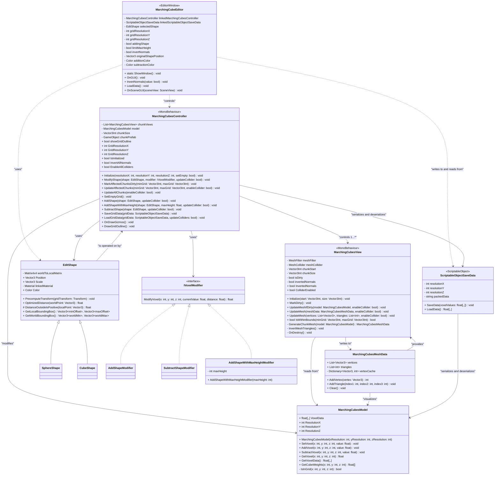

# Class diagram

```mermaid
classDiagram
    class MarchingCubesController {
        - List~MarchingCubesView~ chunkViews
        - MarchingCubesModel model
        - Vector3Int chunkSize
        - GameObject chunkPrefab
        + bool showGridOutline
        + int GridResolutionX
        + int GridResolutionY
        + int GridResolutionZ
        + Initialize(resolutionX: int, resolutionY: int, resolutionZ: int, setEmpty: bool) void
        + bool IsInitialized
        + ModifyShape(shape: EditShape, modifier: IVoxelModifier, updateCollider: bool) void
        + MarkAffectedChunksDirty(minGrid: Vector3Int, maxGrid: Vector3Int) void
        + UpdateAffectedChunks(minGrid: Vector3Int, maxGrid: Vector3Int, enableCollider: bool) void
        + UpdateAllChunks(enableCollider: bool) void
        + bool InvertAllNormals
        + bool EnableAllColliders
        + SetEmptyGrid() void
        + AddShape(shape: EditShape, updateCollider: bool) void
        + AddShapeWithMaxHeight(shape: EditShape, maxHeight: float, updateCollider: bool) void
        + SubtractShape(shape: EditShape, updateCollider: bool) void
        + SaveGridData(gridData: ScriptableObjectSaveData) void
        + LoadGridData(gridData: ScriptableObjectSaveData, updateColliders: bool) void
        + OnDrawGizmos() void
        + DrawGridOutline() void
    }
    <<MonoBehaviour>> MarchingCubesController

    class MarchingCubesView {
        - MeshFilter meshFilter
        - MeshCollider meshCollider
        - Vector3Int chunkStart
        - Vector3Int chunkSize
        - bool isDirty
        - bool invertedNormals
        + Initialize(start: Vector3Int, size: Vector3Int) void
        + MarkDirty() void
        + UpdateMeshIfDirty(model: MarchingCubesModel, enableCollider: bool) void
        + UpdateMesh(meshData: MarchingCubesMeshData, enableCollider: bool) void
        + UpdateMesh(vertices: List~Vector3~, triangles: List~int~, enableCollider: bool) void
        + bool InvertedNormals
        + bool ColliderEnabled
        + bool IsWithinBounds(minGrid: Vector3Int, maxGrid: Vector3Int) bool
        - GenerateChunkMesh(model: MarchingCubesModel) MarchingCubesMeshData
        - InvertMeshTriangles() void
        - OnDestroy() void
    }
    <<MonoBehaviour>> MarchingCubesView

    class MarchingCubesModel {
        + float[,,] VoxelData
        + MarchingCubesModel(xResolution: int, yResolution: int, zResolution: int)
        + int ResolutionX
        + int ResolutionY
        + int ResolutionZ
        + SetVoxel(x: int, y: int, z: int, value: float) void
        + AddVoxel(x: int, y: int, z: int, value: float) void
        + SubtractVoxel(x: int, y: int, z: int, value: float) void
        + GetVoxel(x: int, y: int, z: int) float
        + GetVoxelData() float[,,]
        + GetCubeWeights(x: int, y: int, z: int) float[]
        - IsInGrid(x: int, y: int, z: int) bool
    }

    class MarchingCubesMeshData {
        + List~Vector3~ vertices
        + List~int~ triangles
        - Dictionary~Vector3, int~ vertexCache
        + AddVertex(vertex: Vector3) int
        + AddTriangle(index1: int, index2: int, index3: int) void
        + Clear() void
    }

    class EditShape {
        - Matrix4x4 worldToLocalMatrix
        + PrecomputeTransform(gridTransform: Transform) void
        + OptimizedDistance(worldPoint: Vector3) float
        # DistanceOutsideIsPositive(localPoint: Vector3) float
        + Vector3 Position
        + Vector3 Scale
        - Material linkedMaterial
        + Color Color
        + GetLocalBoundingBox() Vector3~minOffset~, Vector3~maxOffset~
        + GetWorldBoundingBox() Vector3~worldMin~, Vector3~worldMax~
    }
    EditShape <|-- SphereShape
    EditShape <|-- CubeShape

    class MarchingCubeEditor {
        - MarchingCubesController linkedMarchingCubesController
        - ScriptableObjectSaveData linkedScriptableObjectSaveData
        - EditShape selectedShape
        - int gridResolutionX
        - int gridResolutionY
        - int gridResolutionZ
        - bool addingShape
        - bool limitMaxHeight
        - bool invertNormals
        - Vector3 originalShapePosition
        - Color additionColor
        - Color subtractionColor
        + static ShowWindow() void
        + OnGUI() void
        + InvertNormals(value: bool) void
        + LoadData() void
        + OnSceneGUI(sceneView: SceneView) void
    }
    <<EditorWindow>> MarchingCubeEditor

    class ScriptableObjectSaveData {
        - int resolutionX
        - int resolutionY
        - int resolutionZ
        - string packedData
        + SaveData(voxelValues: float[,,]) void
        + LoadData() float[,,]
    }
    <<ScriptableObject>> ScriptableObjectSaveData

    class IVoxelModifier {
        <<interface>>
        ModifyVoxel(x: int, y: int, z: int, currentValue: float, distance: float) float
    }

    class AddShapeModifier
    class SubtractShapeModifier
    class AddShapeWithMaxHeightModifier {
        - int maxHeight
        + AddShapeWithMaxHeightModifier(maxHeight: int)
    }
    IVoxelModifier <|.. AddShapeModifier
    IVoxelModifier <|.. SubtractShapeModifier
    IVoxelModifier <|.. AddShapeWithMaxHeightModifier

    MarchingCubesController --> IVoxelModifier : "uses"
    MarchingCubeEditor ..> MarchingCubesController : "controls"
    MarchingCubeEditor ..> EditShape : "uses"
    MarchingCubeEditor ..> ScriptableObjectSaveData : "writes to and reads from"
    MarchingCubesController --> MarchingCubesModel : "modifies"
    MarchingCubesController --> MarchingCubesView : "controls 1...*"
    MarchingCubesController --> EditShape : "uses"
    MarchingCubesController --> ScriptableObjectSaveData : "serializes and deserializes"
    MarchingCubesView --> MarchingCubesModel : "reads from"
    MarchingCubesView --> MarchingCubesMeshData : "writes to"
    MarchingCubesMeshData --> MarchingCubesView : "provides"
    EditShape --> MarchingCubesController : "is operated on by"
    MarchingCubesMeshData --> MarchingCubesModel : "visualizes"
    ScriptableObjectSaveData --> MarchingCubesModel : "serializes and deserializes"
```