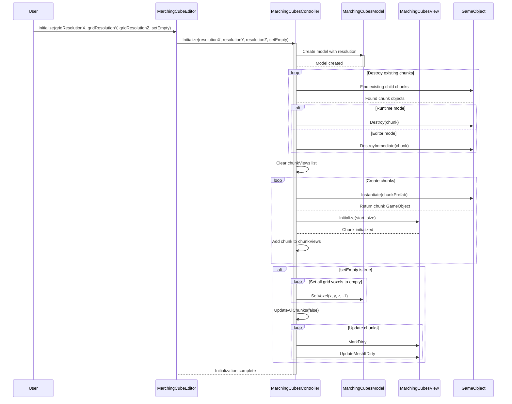
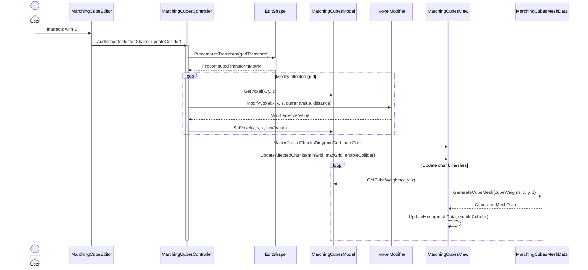

# Sequence diagrams
## Initialization

```mermaid
sequenceDiagram
    participant User
    participant MarchingCubeEditor
    participant MarchingCubesController
    participant MarchingCubesModel
    participant MarchingCubesView
    participant GameObject

    User ->> MarchingCubeEditor: Initialize(gridResolutionX, gridResolutionY, gridResolutionZ, setEmpty)
    MarchingCubeEditor ->> MarchingCubesController: Initialize(resolutionX, resolutionY, resolutionZ, setEmpty)
    
    activate MarchingCubesController
    MarchingCubesController ->> MarchingCubesModel: Create model with resolution
    activate MarchingCubesModel
    MarchingCubesModel --> MarchingCubesController: Model created
    deactivate MarchingCubesModel
    
    loop Destroy existing chunks
        MarchingCubesController ->> GameObject: Find existing child chunks
        GameObject --> MarchingCubesController: Found chunk objects
        alt Runtime mode
            MarchingCubesController ->> GameObject: Destroy(chunk)
        else Editor mode
            MarchingCubesController ->> GameObject: DestroyImmediate(chunk)
        end
    end

    MarchingCubesController ->> MarchingCubesController: Clear chunkViews list
    
    loop Create chunks
        MarchingCubesController ->> GameObject: Instantiate(chunkPrefab)
        GameObject --> MarchingCubesController: Return chunk GameObject
        MarchingCubesController ->> MarchingCubesView: Initialize(start, size)
        MarchingCubesView --> MarchingCubesController: Chunk initialized
        MarchingCubesController ->> MarchingCubesController: Add chunk to chunkViews
    end
    
    alt setEmpty is true
        loop Set all grid voxels to empty
            MarchingCubesController ->> MarchingCubesModel: SetVoxel(x, y, z, -1)
        end
        MarchingCubesController ->> MarchingCubesController: UpdateAllChunks(false)
        loop Update chunks
            MarchingCubesController ->> MarchingCubesView: MarkDirty
            MarchingCubesController ->> MarchingCubesView: UpdateMeshIfDirty
        end
    end

    MarchingCubesController --> MarchingCubeEditor: Initialization complete
    deactivate MarchingCubesController
```    

## Editing

```mermaid
sequenceDiagram
    actor User

    User ->> MarchingCubeEditor: Interacts with UI
    MarchingCubeEditor ->> MarchingCubesController: AddShape(selectedShape, updateCollider)

    activate MarchingCubesController
    MarchingCubesController ->> EditShape: PrecomputeTransform(gridTransform)
    activate EditShape
    EditShape -->> MarchingCubesController: PrecomputedTransformMatrix
    deactivate EditShape

    loop Modify affected grid
        MarchingCubesController ->> MarchingCubesModel: GetVoxel(x, y, z)
        MarchingCubesController ->> IVoxelModifier: ModifyVoxel(x, y, z, currentValue, distance)
        IVoxelModifier -->> MarchingCubesController: ModifiedVoxelValue
        MarchingCubesController ->> MarchingCubesModel: SetVoxel(x, y, z, newValue)
    end

    MarchingCubesController ->> MarchingCubesView: MarkAffectedChunksDirty(minGrid, maxGrid)
    MarchingCubesController ->> MarchingCubesView: UpdateAffectedChunks(minGrid, maxGrid, enableCollider)

    loop Update chunk meshes
        MarchingCubesView ->> MarchingCubesModel: GetCubeWeights(x, y, z)
        MarchingCubesView ->> MarchingCubesMeshData: GenerateCubeMesh(cubeWeights, x, y, z)
        MarchingCubesMeshData -->> MarchingCubesView: GeneratedMeshData
        MarchingCubesView ->> MarchingCubesView: UpdateMesh(meshData, enableCollider)
    end

    deactivate MarchingCubesController
```