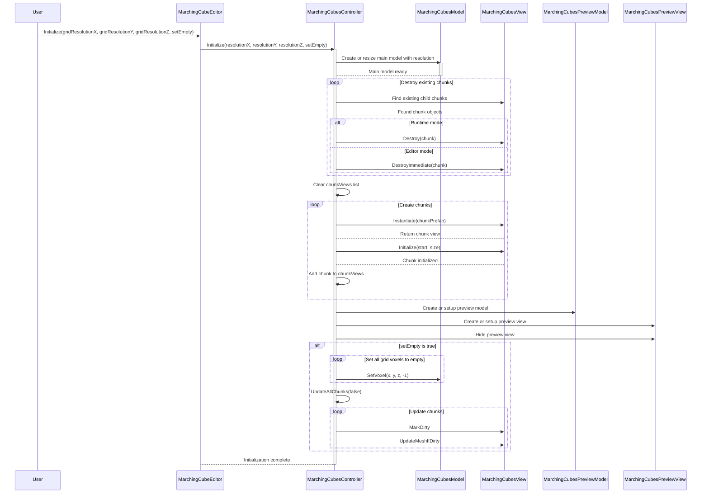
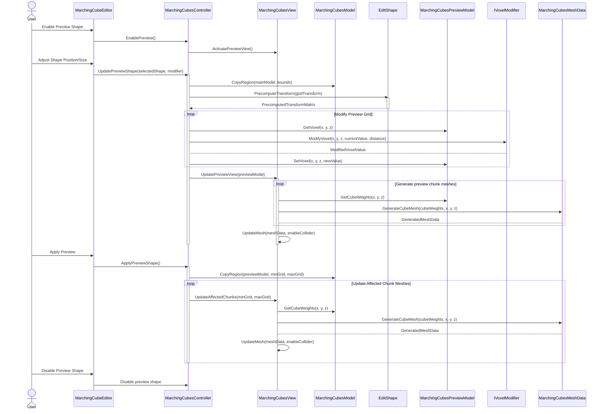

# Sequence diagrams
## Initialization

```mermaid
sequenceDiagram
    participant User
    participant MarchingCubeEditor
    participant MarchingCubesController
    participant MarchingCubesModel
    participant MarchingCubesView
    participant MarchingCubesPreviewModel
    participant MarchingCubesPreviewView

    User ->> MarchingCubeEditor: Initialize(gridResolutionX, gridResolutionY, gridResolutionZ, setEmpty)
    MarchingCubeEditor ->> MarchingCubesController: Initialize(resolutionX, resolutionY, resolutionZ, setEmpty)
    
    activate MarchingCubesController
    MarchingCubesController ->> MarchingCubesModel: Create or resize main model with resolution
    activate MarchingCubesModel
    MarchingCubesModel --> MarchingCubesController: Main model ready
    deactivate MarchingCubesModel

    loop Destroy existing chunks
        MarchingCubesController ->> MarchingCubesView: Find existing child chunks
        MarchingCubesView --> MarchingCubesController: Found chunk objects
        alt Runtime mode
            MarchingCubesController ->> MarchingCubesView: Destroy(chunk)
        else Editor mode
            MarchingCubesController ->> MarchingCubesView: DestroyImmediate(chunk)
        end
    end

    MarchingCubesController ->> MarchingCubesController: Clear chunkViews list
    
    loop Create chunks
        MarchingCubesController ->> MarchingCubesView: Instantiate(chunkPrefab)
        MarchingCubesView --> MarchingCubesController: Return chunk view
        MarchingCubesController ->> MarchingCubesView: Initialize(start, size)
        MarchingCubesView --> MarchingCubesController: Chunk initialized
        MarchingCubesController ->> MarchingCubesController: Add chunk to chunkViews
    end
    
    MarchingCubesController ->> MarchingCubesPreviewModel: Create or setup preview model

    MarchingCubesController ->> MarchingCubesPreviewView: Create or setup preview view

    MarchingCubesController ->> MarchingCubesPreviewView: Hide preview view


    alt setEmpty is true
        loop Set all grid voxels to empty
            MarchingCubesController ->> MarchingCubesModel: SetVoxel(x, y, z, -1)
        end
        MarchingCubesController ->> MarchingCubesController: UpdateAllChunks(false)
        loop Update chunks
            MarchingCubesController ->> MarchingCubesView: MarkDirty
            MarchingCubesController ->> MarchingCubesView: UpdateMeshIfDirty
        end
    end

    MarchingCubesController --> MarchingCubeEditor: Initialization complete
    deactivate MarchingCubesController
```    

## Editing

```mermaid
sequenceDiagram
    actor User

    User ->> MarchingCubeEditor: Enable Preview Shape
    MarchingCubeEditor ->> MarchingCubesController: EnablePreview()
    MarchingCubesController ->> MarchingCubesView: ActivatePreviewView()

    User ->> MarchingCubeEditor: Adjust Shape Position/Size
    MarchingCubeEditor ->> MarchingCubesController: UpdatePreviewShape(selectedShape, modifier)
    activate MarchingCubesController
    MarchingCubesController ->> MarchingCubesModel: CopyRegion(mainModel, bounds)
    MarchingCubesController ->> EditShape: PrecomputeTransform(gridTransform)
    activate EditShape
    EditShape -->> MarchingCubesController: PrecomputedTransformMatrix
    deactivate EditShape

    loop Modify Preview Grid
        MarchingCubesController ->> MarchingCubesPreviewModel: GetVoxel(x, y, z)
        MarchingCubesController ->> IVoxelModifier: ModifyVoxel(x, y, z, currentValue, distance)
        IVoxelModifier --> MarchingCubesController: ModifiedVoxelValue
        MarchingCubesController ->> MarchingCubesPreviewModel: SetVoxel(x, y, z, newValue)
    end

    MarchingCubesController ->> MarchingCubesView: UpdatePreviewView(previewModel)
    activate MarchingCubesView
    loop Generate preview chunk meshes
        MarchingCubesView ->> MarchingCubesPreviewModel: GetCubeWeights(x, y, z)
        MarchingCubesView ->> MarchingCubesMeshData: GenerateCubeMesh(cubeWeights, x, y, z)
        MarchingCubesMeshData --> MarchingCubesView: GeneratedMeshData
    end
    MarchingCubesView ->> MarchingCubesView: UpdateMesh(meshData, enableCollider)
    deactivate MarchingCubesView
    deactivate MarchingCubesController

    User ->> MarchingCubeEditor: Apply Preview
    MarchingCubeEditor ->> MarchingCubesController: ApplyPreviewShape()
    activate MarchingCubesController
    MarchingCubesController ->> MarchingCubesModel: CopyRegion(previewModel, minGrid, maxGrid)

    loop Update Affected Chunk Meshes
        MarchingCubesController ->> MarchingCubesView: UpdateAffectedChunks(minGrid, maxGrid)
        MarchingCubesView ->> MarchingCubesModel: GetCubeWeights(x, y, z)
        MarchingCubesView ->> MarchingCubesMeshData: GenerateCubeMesh(cubeWeights, x, y, z)
        MarchingCubesMeshData --> MarchingCubesView: GeneratedMeshData
        MarchingCubesView ->> MarchingCubesView: UpdateMesh(meshData, enableCollider)
    end
    deactivate MarchingCubesController

    User ->> MarchingCubeEditor: Disable Preview Shape
    MarchingCubeEditor ->> MarchingCubesController: Disable preview shape
```